# Guía de Ejecución y Documentación — Examen Final 

ITAM - Otoño 2025

Computational Foundations of Data Science 

Edgar Daniel Diaz Nava (174415)


### Estructura lógica del pipeline
El script `examen_code.sh` implementa un **pipeline reproducible** para preparar y analizar el conjunto de datos **Adult** (UCI) usando utilidades de *shell* para la limpieza y preparación de datos, R para el análisis exploratorio, Python para el entrenamiento de modelos y la puesta en producción de APIs. Las fases son:

### 1. **Descarga y preparación del directorio de trabajo**

Los comandos de esta sección se encuentran en el archivo `data_prep.sh`.

Asumimos la existencia del archivo en el [repositorio](https://archive.ics.uci.edu/ml/machine-learning-databases/auto-mpg/auto-mpg.data) de la Universidad de California Irvine (UCI) 

```bash
# Descargamos los archivos
wget -O ./data/raw/auto-mpg.data -q https://archive.ics.uci.edu/ml/machine-learning-databases/auto-mpg/auto-mpg.data
```

Una vez descargado el archivo, se limnpia la base de datos efectuando las siguientes transformaciones:

```bash
# Limpiamos los datos crudos 
cat ./data/raw/auto-mpg.data | tr -s ' ' | sed 's/\t/ /g' | sed 's/ /,/g' | grep -v "?" | sed 's/^,//g' > './data/clean/auto_mpg_noheader.csv'
```

El comando lee el archivo `auto-mpg.data` y lo transforma en un archivo CSV limpio:  


    - `tr -s ' '` :  normaliza los separadores reduciendo múltiples espacios consecutivos a uno solo.

    - `sed 's/\t/ /g'` : Luego reemplaza cualquier tabulador por un espacio para unificar el formato.

    - `sed 's/ /,/g'` : Después convierte todos los espacios en comas, transformando los datos a formato CSV. 

    - `grep -v "?"` : A continuación elimina todas las filas que contienen el carácter `?`, descartando registros con valores faltantes.

    - `sed 's/^,//g'` Posteriormente remueve comas al inicio de cada línea que puedan haberse generado por espacios iniciales en el archivo original. 
 
 Finalmente, escribe el resultado en el archivo `auto_mpg_noheader.csv`, produciendo un CSV sin encabezado y sin valores faltantes.

Generamos un encabezado para la base de datos. 

```bash
# Creamos el header 
cat << EOF > ./data/clean/headers.csv
mpg,cylinders,displacement,horsepower,weight,acceleration,model_year,origin,car_name
EOF
```

Con encabezado y datos, construimos la base de datos a utilizar en el análisis. 


```bash
# Creamos la base de datos 
cat ./data/clean/headers.csv ./data/clean/auto_mpg_noheader.csv > './data/clean/auto_mpg.csv'
```

### 2. **EDA en R**

El análisis presentado en esta sección de Exploración se encuentra en el archivo `eda.R`. Algunos de los resultados los presentamos en las siguientes imagenes: 


Análisis Bivariado de las variables numericas por origen: 

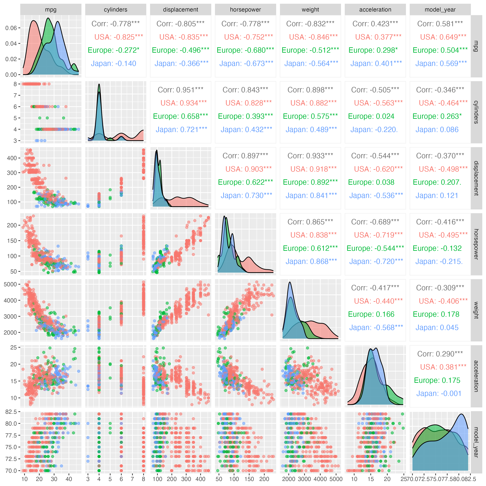


Análisis de distribuciones y relaciones entre las variables y la variable originales: 

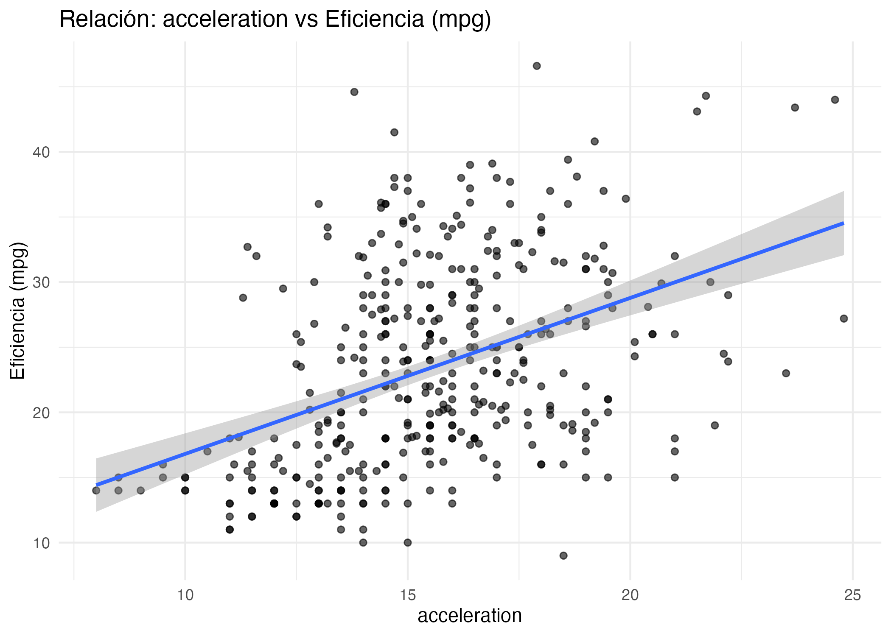


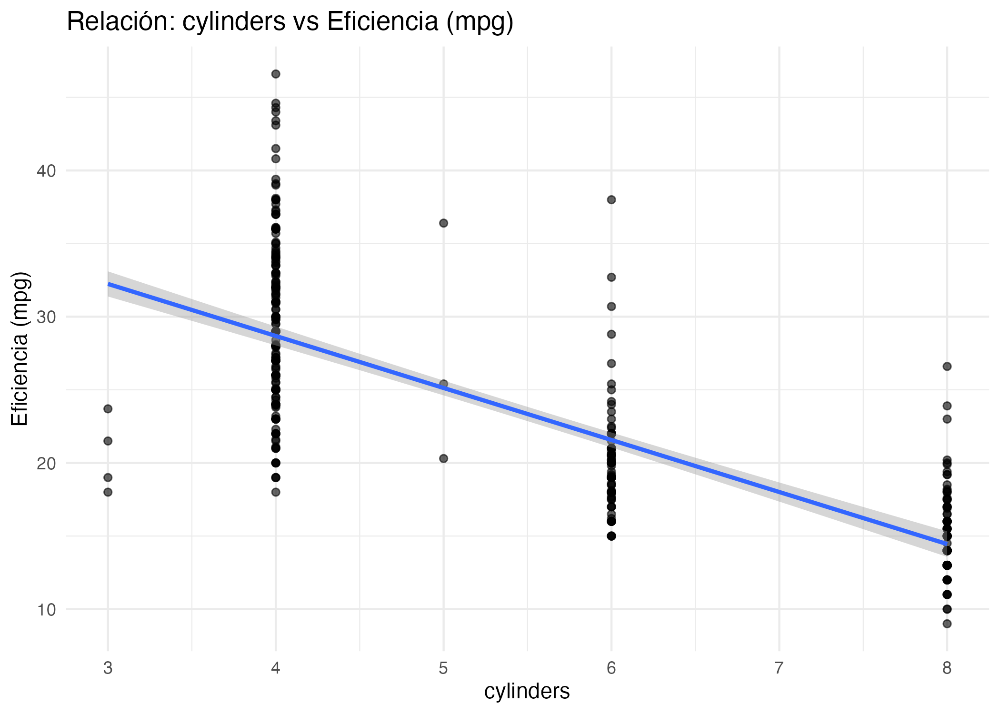


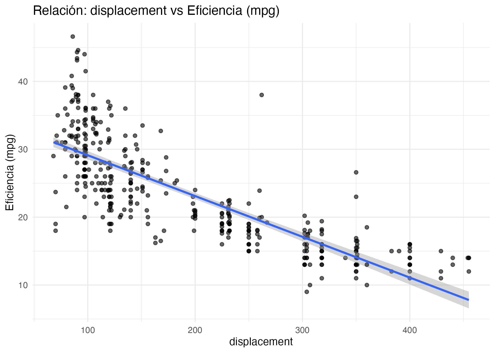


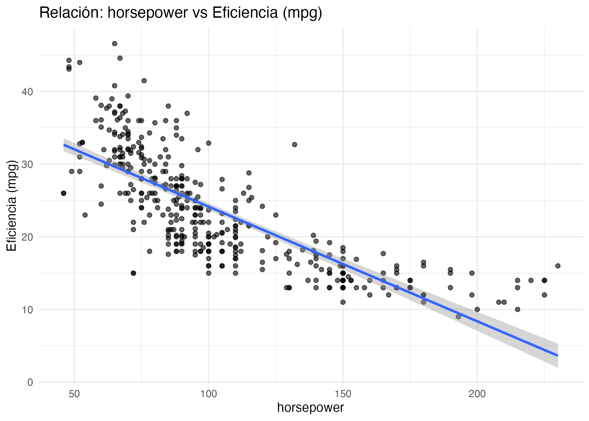


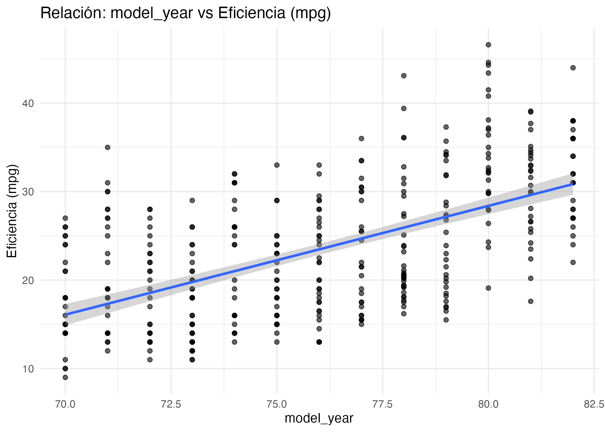


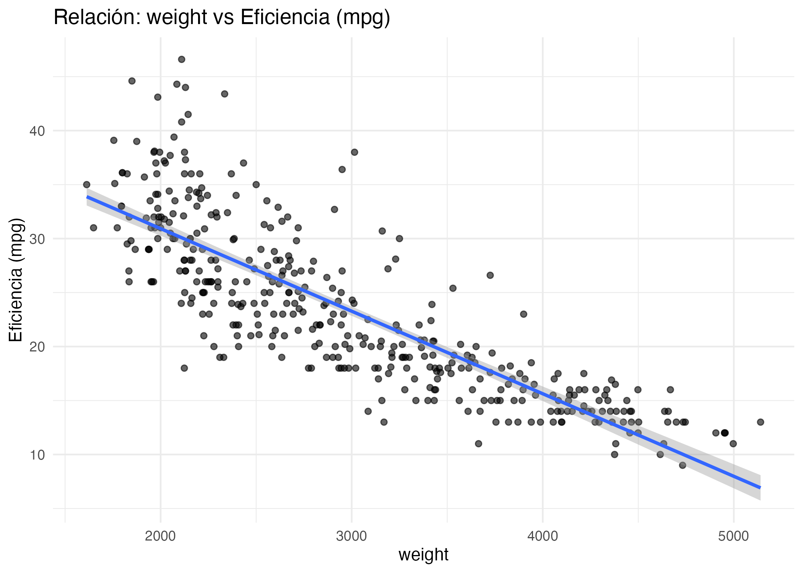


A partir de estos análisis decidimos que vamos a construir un Random Forest Regressor para poder predecir la varoable "mpg" en función de las otras variables numéricas y la categorica "origen". 


### 3.- **Formato Feather**

Con la finalidad de poder manejar los datos que hemos descargado y limpiado en un formato compacto para poder ser consumido en un tablero productivo y como insumo en el ajuste de un modelo de ML (Random Forest), guardamos en formato Feather la data limpia:

Limpieza realizada en R: 

```r
### ----------------------------------------------------------------------------
### PARAMETROS Y DATOS ---------------------------------------------------------

RAW_DATA <- "./data/raw/"
PREP_DATA <- "./data/prep/"
CLEAN_DATA <- "./data/clean/"

FILE_NAME <- "auto_mpg.csv"
FILE_FEATHER <- "auto_mpg.feather"

OUT_DIR <- './figures/'

# Se lee el archivo
data <- read.csv(paste0(CLEAN_DATA, FILE_NAME))

# Convertir 'origin' (1, 2, 3) a Factor
# 1: USA, 2: Europe, 3: Japan
data$origin <- factor(data$origin, 
                      levels = c(1, 2, 3), 
                      labels = c("USA", "Europe", "Japan"))


# Garantizamos que horsepower sea numerico 
data$horsepower <- as.numeric(data$horsepower)
```

Almacenamiento en el formato en particular: 

```r
### ----------------------------------------------------------------------------
### Guardamos Data Limpía ------------------------------------------------------

# Guardamos en formato feather 
write_feather(data, paste0(CLEAN_DATA, FILE_FEATHER))
```

Las siguiente secciones hacen referencia a los pasos realizados en el archivo `train.py`, donde se leen los datos limpios para entrenar un Bosque Aleatorio en su formato de regresión. La ejecución de este archivo se realiza con el comando:

```bash 
# Entrenamiento del modelo 
python3 train.py

```

### 4.- **Entrenamiento del Modelo en Python**

Para entrenar el modelo en Python lo realizamos con el siguiente comando:

```python
### ----------------------------------------------------------------------------
### Data Preparation 

# Leemos la base de Datos 
df = pd.read_feather(CLEAN_DATA + FILE_NAME)

data_encoded = pd.get_dummies(df, columns=['origin'], drop_first=True)


# Separamos en respuesta y regresores 

# Respuesta 
y = data_encoded[OBJECTIVE_VAR]

# Regresores (tiramos la respuesta y variables no informativas)
X = data_encoded.drop(columns=[OBJECTIVE_VAR], axis = 1)
X = X.drop(columns=DROP_VARS)

# Train-test data split 
X_train, X_test, y_train, y_test = train_test_split(X, y, test_size=0.2, random_state=999)


### ----------------------------------------------------------------------------
### Entrenamiento del modelo 

# Model training
model = RandomForestRegressor(n_estimators=100, random_state=999)
model.fit(X_train, y_train)

### ----------------------------------------------------------------------------
### Guardamos el modelo 

# Guardar modelo Y las columnas (crucial para la API)
joblib.dump(model, MODEL_PATH)
joblib.dump(X.columns.tolist(), MODEL_COLS_PATH)

```

### 5.- **Evaluación del Modelo**

En el presente bloque realizamos la evaluación del modelo entrenado con los datos de prueba, evaluanlo las metricas $r^2$ y el MSE. 

```python

### ----------------------------------------------------------------------------
### Evaluación del modelo 

y_pred = model.predict(X_test)
mse = mean_squared_error(y_test, y_pred)
r2  = r2_score(y_test, y_pred)

print(f"MSE: {mse:.4f}")
print(f"R² : {r2:.4f}")

```

### 6.- **API REST con FastAPI**

Para la configuración de la API, usaremos el siguiente código que se encuentra en el archivo `main.py`, donde se define la API así como la lógica de carga de los logs en la base de datos MySQL que vamos a crear en EC2. 

Como primer paso, creamos la clase FastAPI y configuramos los endpoints: 

```python

### ----------------------------------------------------------------------------
### Construimos clases y metodos para la API

# Iniciamos la clase de FastAPI
app = FastAPI()

# Cargargamos el modelo ya entrenado 
model = joblib.load(MODEL_PATH)
model_columns: List[str] = joblib.load(MODEL_COLS_PATH)

# Auxiliar para stats en memoria
predictions_history: List[float] = []


# Modelo Pydantic para entrada de datos 
class CarFeatures(BaseModel):
    cylinders: int
    displacement: float
    horsepower: float
    weight: float
    acceleration: float
    model_year: int
    origin: str  # "USA", "Europe", "Japan"


# Metodo POST  para generar la inferencia 
@app.post("/predict")
def predict_mpg(req: CarFeatures):
    # Preprocesamos con una funcion auxiliar definida abajo
    X = preprocess_request(req)
    pred = float(model.predict(X)[0])

    # Guardardamos en historial en memoria
    predictions_history.append(pred)

    # Guardardamos en un DB con una función auxiliar para escribir en MySQL
    insert_log_to_db(
        {
            "origin_text": str(req.origin) if isinstance(req.origin, str) else None,
            "origin_num":  int(req.origin) if isinstance(req.origin, int) else None,
        },
        pred
    )

    # Devuelve la prediccion
    return {"mpg_prediction": pred}

# Metodo GET para atraer los 
@app.get("/stats")
def stats():
    """
    Devuelve conteo, promedio, máximo y mínimo de predicciones hechas
    durante la vida del proceso (en memoria).
    """
    if not predictions_history:
        return {
            "count": 0,
            "mean": None,
            "max": None,
            "min": None
        }

    import numpy as np
    arr = np.array(predictions_history)
    return {
        "count": int(arr.size),
        "mean": float(arr.mean()),
        "max": float(arr.max()),
        "min": float(arr.min())
    } 

```

En el mismo scrip, definimos funciones auxiliares para el procesamiento de datos y el registro de las peticiones de inferencia en la tabla de logs:  

```python
### ----------------------------------------------------------------------------
### Funciones auxiliares para registro de Logs 

# Config DB usando variables de entorno (seguridad y buena practica)
DB_HOST = os.getenv("DB_HOST")
DB_USER = os.getenv("DB_USER")
DB_PASS = os.getenv("DB_PASS")
DB_NAME = os.getenv("DB_NAME")

# Funcion para insertar valores en la tabla 
def insert_log_to_db(input_data: dict, prediction: float):
    """
    Inserta un registro en la tabla logs.
    """
    if not DB_HOST:
        # Si no hay config, nada - DEBUG 
        return


    try:
        conn = mysql.connector.connect(
            host=DB_HOST,
            user=DB_USER,
            password=DB_PASS,
            database=DB_NAME
        )
        cursor = conn.cursor()

        query = """
        INSERT INTO logs (cylinders, displacement,horsepower,weight,acceleration,model_year,origin,mpg_pred)
        VALUES (%s, %s, %s, %s, %s, %s, %s, %s)
        """

        cylinders = input_data.get("cylinders")
        displacement  = input_data.get("displacement")
        horsepower  = input_data.get("horsepower")
        weight  = input_data.get("weight")
        acceleration  = input_data.get("acceleration")
        model_year  = input_data.get("model_year")
        origin  = input_data.get("origin")

        cursor.execute(query,
                        (cylinders, displacement,horsepower,weight,acceleration,model_year,origin,prediction)
                        )
        conn.commit()
        cursor.close()
        conn.close()

    except Error as e:
        print(f"Error al insertar en DB: {e}")

```

Construimos la siguiente función auxiliar para trabajar con los valores de entrada: 

```python

def preprocess_request(req: CarFeatures) -> pd.DataFrame:
    """
    Transforma la request a un DataFrame con las mismas columnas
    que se usaron para entrenar (model_columns).
    """
    base = {
        "cylinders": req.cylinders,
        "displacement": req.displacement,
        "horsepower": req.horsepower,
        "weight": req.weight,
        "acceleration": req.acceleration,
        "model_year": req.model_year,
    }

    # Manejo de origin
    # o origin_USA, origin_Europe, origin_Japan, etc.

    row = pd.DataFrame([base])

    # Creamos un DataFrame para origin y hacemos get_dummies
    origin_df = pd.DataFrame([{"origin": req.origin}])
    origin_dummies = pd.get_dummies(origin_df["origin"], prefix="origin")

    # Hacemos el join
    row = row.join(origin_dummies)

    # Asegurar que tiene exactamente las columnas de entrenamiento
    for col in model_columns:
        if col not in row.columns:
            row[col] = 0  # columna dummy faltante

    row = row[model_columns]

    return row

```


### 7.- **Base de Datos MySQL en RDS**

Para poder llevar el proyecto a la nube (AWS) se requiere primero de una configuración básica de las herramientas necesarias para desplegar nuestra solución. IAM para la creaciuón de un usuario con el cuál podamos ejecutar las acciones requeridas en conjunto con sus respectivas credencias, EC2 para levantar la instancia de Linux que estaremos utilizando para ejecutar el contenedor donde corre nuestro código, y una instancia de RDS , dónde desplegaremos la base de datos con motor de MySQL que almacenará las llamadas a nuestra API. 

#### Creación de rol en IAM

El primer paso, es crear un rol de seguridad para los aplicativos de AWS. 

Abrimos el producto de IAM. 
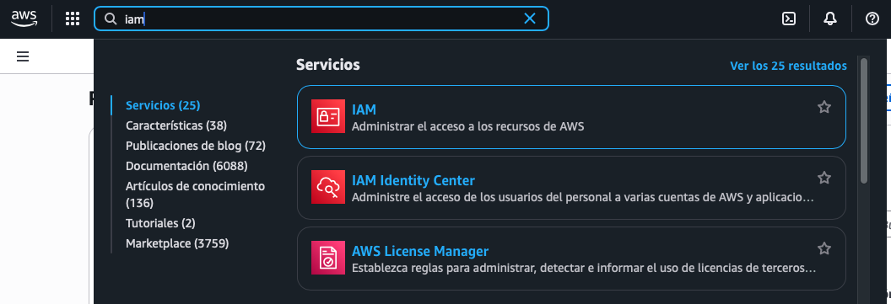

Creamos a una persona:
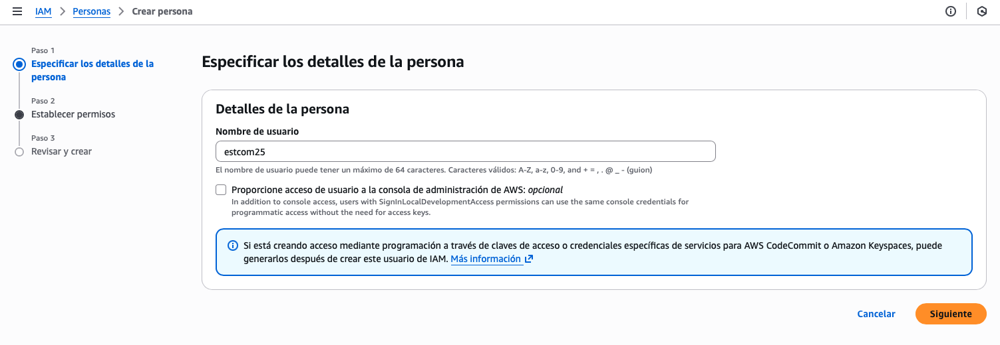

Le damos los permisos necesarios ya preconfigurados por AWS para el acceso completo a los aplicativos a utilizar: RDS, EC2, S3. 
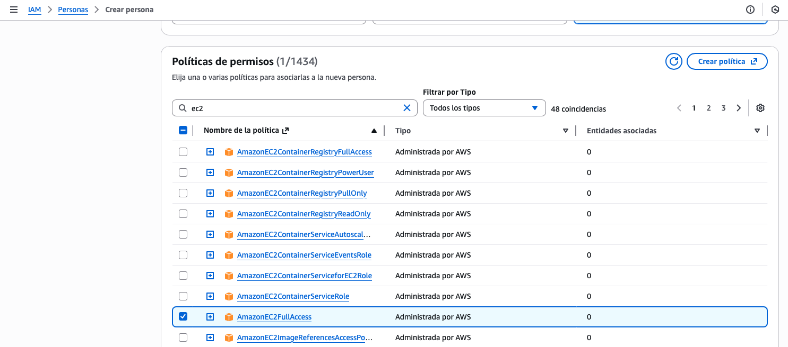

Finalmente, creamos y descargamos nuestras claves de acceso (Poner en un folder seguro)
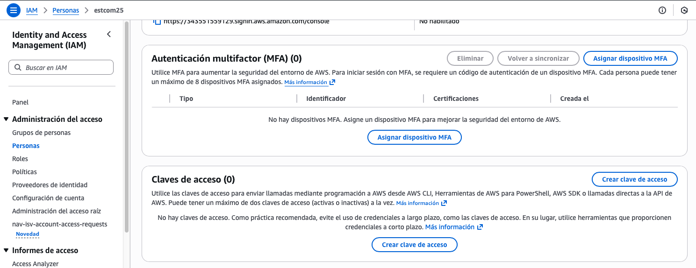


#### Creación de instancia en EC2 

Abrimos el aplicativo de EC2: 
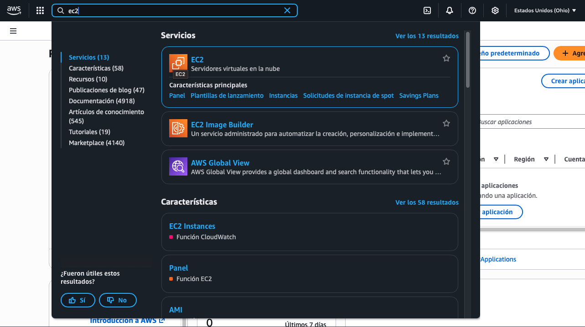

Damos click en crear una nueva instancia:
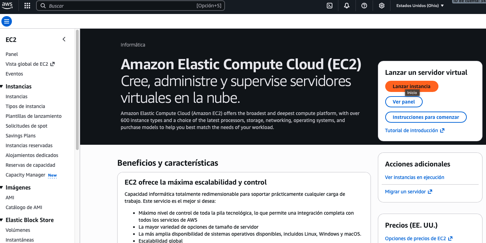

Seleccionamos el sistema operativo base Linux gestionado por AWS:
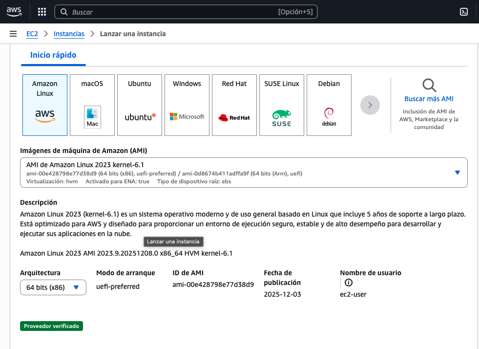

Creamos un par de llaves con las configuraciones de seguridad predefinidas: 
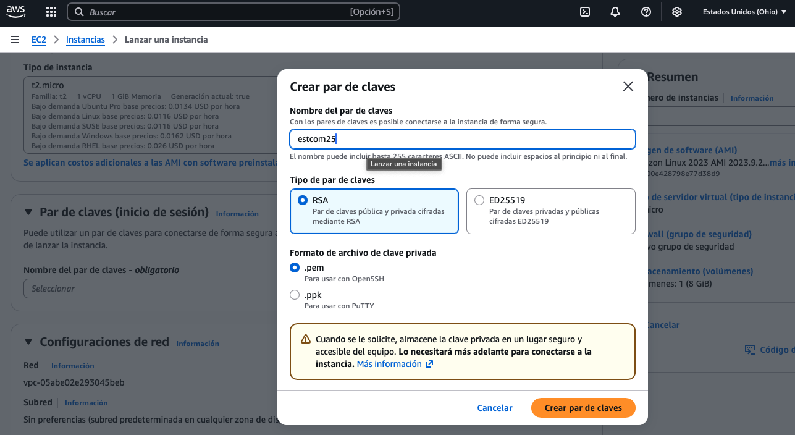

Seleccionamos las configuraciones de red mostradas en la imagen y damos click en el botón de Lanzar. 
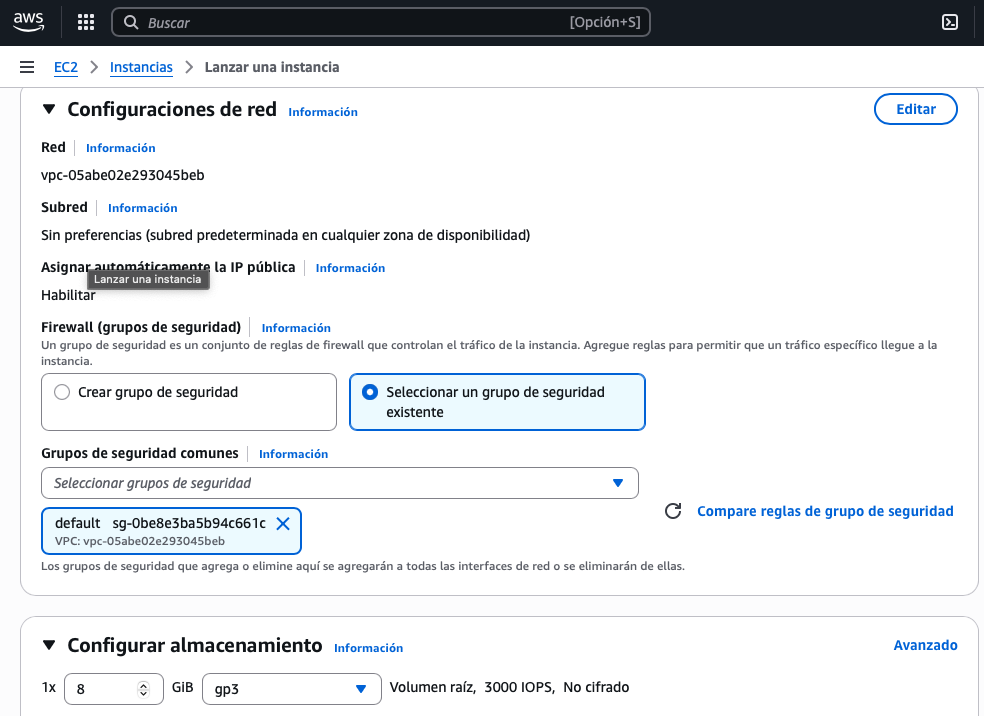

Finalmente, en la lista de instancias, deberíamos de ver la instancia creada y activa, tal como en la imágen:
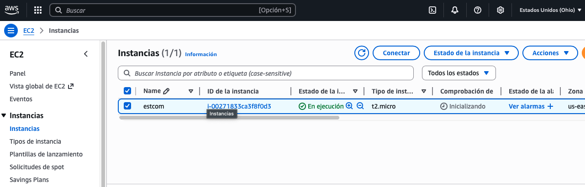


Al levantar la instancia y conectar con EC2, validar la presencia de librerias necesarias por medio de los siguientes comandos:

```bash
# MySQL
sudo dnf install -y mariadb105

# Git 
sudo dnf update -y
sudo dnf install -y git

# Docker 
sudo dnf install -y docker

```


#### Creación de Base de Datos MySQL en RDS

Finalmente, configuramos la base de datos MySQL en el servicio RDS de AWS, siguiendo los siguientes pasos desde la consola de AWS:

Primero, abrimos el servicio RDS:
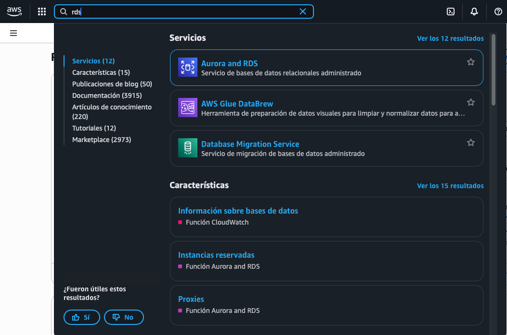

Damos click en el boton de "Crear una base de datos"
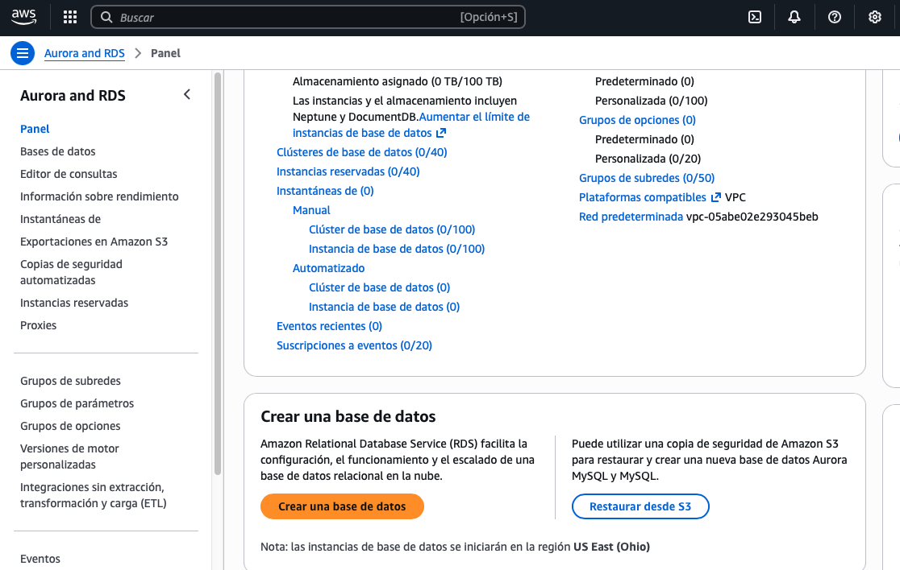

Seleccionamos el motor de nuestra base de datos, en este caso MySQL. 
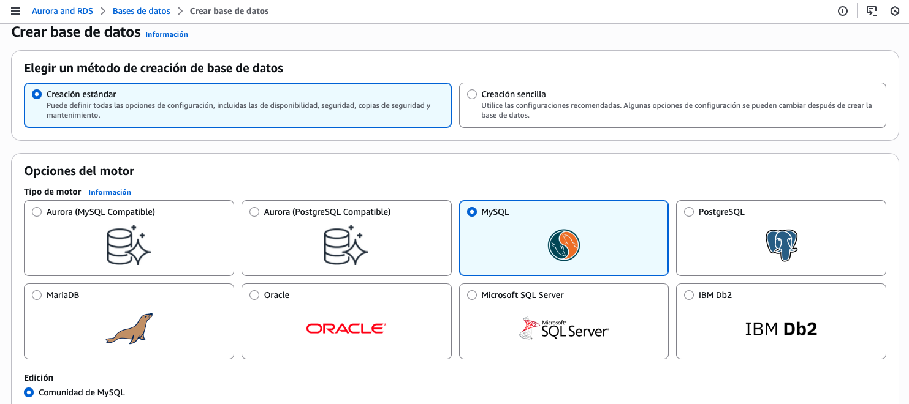

Configuramos el tipo de producto y plantillas, en este caso utilizamos una plantilla de prueba:
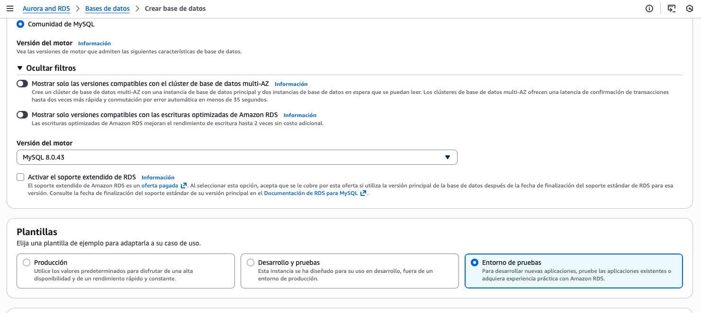

Configuramos tal como se muesta en las siguientes imagenes:
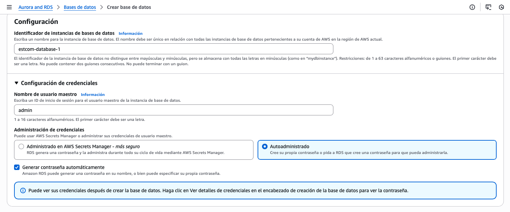

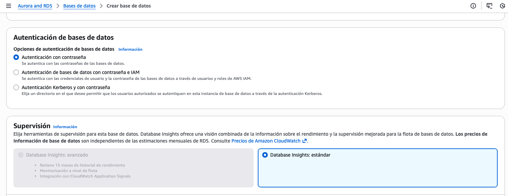

Después de dar click en el botón de crear deberíamos de ver nuestro engine en la lista de bases de datos:
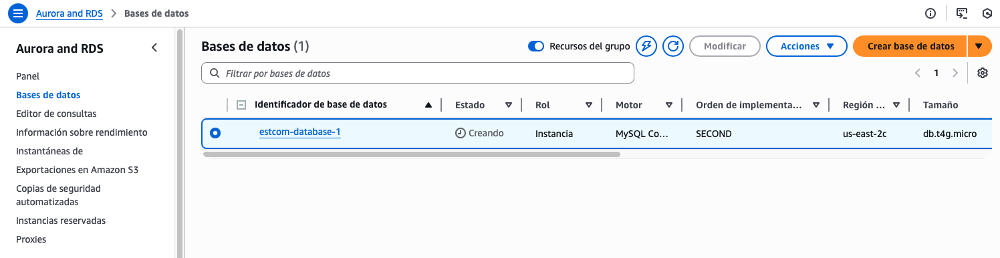

Finalmente, configuramos nuestra base en términos de seguridad para la transmisión de datos abierta:
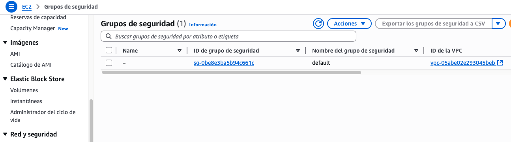


Para poder utilizar la base de datos que acabamos de crear y definir la tabla de logs que se pide, primero tenemos que conectarnos a la base de datos y crear el esquema, para ello, ejecutamos los siguientes comandos en la terminal, para validar que tenemos correcto acceso a la instancia:

```bash
# Ejecutando en el directorio con las credenciales 
chmod 400 "estcom25.pem"  
ssh -i "estcom25.pem" ec2-user@ec2-18-191-218-57.us-east-2.compute.amazonaws.com
```

Una vez que nos conectamos con éxito:

["Conexión exitosa"](./figures/ssh_exito.png)

Realizamos los siguientes comandos para conectar con nuestra base de datos en RDS

```bash
mysql -h estcom-database-1.cfi228c6orl8.us-east-2.rds.amazonaws.com \
      -P 3306 \
      -u admin \
      -p 
```

Una vez dentro de la línea de comandos de MySQL, ejecutamos el siguiente comando para la creación de la tabla logs:

```sql
CREATE DATABASE IF NOT EXISTS estcom_db
  CHARACTER SET utf8mb4
  COLLATE utf8mb4_unicode_ci;

USE "estcom_db";

CREATE TABLE logs (
    id            BIGINT UNSIGNED AUTO_INCREMENT PRIMARY KEY,
    cylinders     INT,
    displacement  FLOAT,
    horsepower    FLOAT,
    weight        FLOAT,
    acceleration  FLOAT,
    model_year    INT,
    origin        VARCHAR(50),
    mpg_pred      FLOAT,
    created_at    TIMESTAMP DEFAULT CURRENT_TIMESTAMP
);
```


### 8.- **Contenerización y Despliegue**

Para guardar en un contenedor el levantamiento de nuestra API en la nube, tenemos que programar los comandos a ejecutar en la instancia de EC2 con un Docker file que podemos encontrar en el archivo `Docerfile.api`, con las siguientes indicaciones:

```dockerfile

FROM python:3.11-slim

WORKDIR /app

# Instalar dependencias
COPY requirements.txt .
RUN pip install --no-cache-dir -r requirements.txt

# Copiar código y modelos
COPY main.py .
COPY model.pkl .
COPY model_columns.pkl .

# Exponer puerto 80
EXPOSE 80

# Comando para correr la app
CMD ["uvicorn", "main:app", "--host", "0.0.0.0", "--port", "80"]

```

Cuyas indicaciones son: 

    - Pedimos utilizar la imagen de python ligera "python:3.11-slim". 
    - Con nuestro archivo `requirements.txt` indicamos las dependencias necesarias para correr el código. 
    - Copiamos los archivos .pkl de los modelos y el main para levantar la API. 
    - Exponemos el puerto 80.
    - Indicamos el comando para iniciar la API en el puerto 80. 
  


Consideremos en este punto dos ventanas de terminal abiertas y con conexión: terminal local en el root de este proyecto y terminal con la conexi´pon SSH a la instancia EC2 de AWS que levantamos. Para poder subir a productivo nuestro proyecto, primero es necesario clonar el repositorio que tenemos en local a la instancia de EC2, el camino que vamos a seguir y el más práctico y estándar: Local -> GitHub -> EC2. 

Así, primero en la terminal en local, y una vez creado el correspondiente repositorio en GitHub, ejecutamos el siguiente push con todo nuestro proyecto (mala práctica, sólo para ejemplo ilustrativo, se tendría que estar actualizando el repo durante todo el proceso de trabajo): 

``` bash 
# Push a repo publico 
git init 
git add .
git commit -m "Carga primera" 
git branch -M main 
git remote add origin 
```

Con el push exitoso, ahora en la terminal de nuestra instancia EC2, ejecutamos:

``` bash 
cd ~
git clone https://github.com/edgar-daniel-codes/basic_aws_deployment.git auto-mpg
cd auto-mpg
``` 

Finalmente, en la terminal de EC2, definimos variables de ambiente directamente (por seguridad y buenas prácticas), de la siguiente forma:

``` bash
cd ~/auto-mpg
nano .env
```

En Nano, definimos : 

```txt
DB_HOST=db_a_conectar.xxxxxx.region.rds.amazonaws.com
DB_USER=admin
DB_PASS=YOUR_RDS_PASSWORD
DB_NAME=estcom_db
``` 

Ya con esto, procedemos a levantar nuestro contenedor:

```bash

# Habilitamos e iniciamos docker  
sudo systemctl start docker
sudo systemctl enable docker

# Damos permiso a Docker 
sudo usermod -aG docker ec2-user

exit
``` 

Salimos, reconectamos con SSH y procedemos: 

```bash

cd ~/auto-mpg

# Construimos la Imagen 
docker build -t auto-mpg-api -f Dockerfile.api .

# Corremos el contenedor de API
docker run -d \
  -p 80:80 \
  --env-file .env \
  --name auto-mpg-api \
  auto-mpg-api
 
``` 

Se puede validar la existencia del API abierta en el siguiente [URL](http://3.141.27.56/docs)

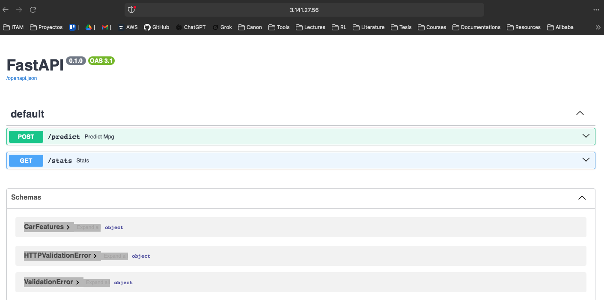

### 9.- Shiny App

En el archivo `app.R` tenemos lel código necesario para desplegar un dashboard basado en web por medio de ayuda de la librería shiny de R, que nos permite diseñar y desplegar visualizaciones interactivas y disponibilizarlas en un servidor local para pruebas o en el puerto de una instancia para acceso público desde cualquier IP. 


Para su despliegue productivo, ya en esta instancia, es importante mencionar que se creo un dockerfile `Docerfile.app` exclusivo para el levantamiento del tablero (por buenas prácticas) utilizando las siguientes indicaciones:

```dockerfile
# Imagen con requerimientos para Shiny apps 
FROM rocker/shiny:latest

# Instalamos dependencias 
RUN R -e "install.packages(c('shinydashboard', 'dplyr', 'readr', 'arrow'), repos = 'https://cloud.r-project.org')"

# Trabajamos en el default de Shiny Server 
WORKDIR /srv/shiny-server

# Hacemos una copia de la app donde se espera por default 
COPY app.R /srv/shiny-server/app.R

# Exponemos el puerto 3838
EXPOSE 3838

# Se corre la app por Default en la imagen
# No hay necesidad de sobre escribir CMD 

```
El proceso es completamente simialr al efectuado para el levantamiento de la API, sólo que utilizando el conteneder anteriormente definido, asumiendo la conexión con SSH a la instancia de EC2 : 

```bash

cd ~/auto-mpg

# Construimos la Imagen 
docker build -t auto-mpg-shiny -f Dockerfile.app .

# Corremos el contenedor de la Shiny App
docker run -d \
  -p 3838:3838 \
  --name auto-mpg-shiny \
  auto-mpg-shiny
 
``` 

El despliegue en url pública se puede validar en el siguiente link de [Dashboard](http://3.141.27.56:3838). 

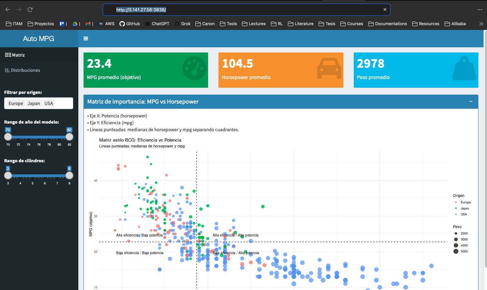
